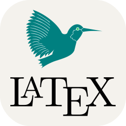

## 
 Hεℓℓø 

### Anthem
  
- 🏃‍♂️ Love to run

- 👨‍💻 Love to code

- 🧠 Thinking makes you happy when you're old
  
## Projects

#### iOS Apps 📱
 -  [iOS project]() (Starting soon) 

#### Capstone Projects | Chemical Engineering at UC Santa Barbara 
 -  [Capstone II](https://github.com/wesleyZero/capstone_II/tree/main) 
 -  [Capstone I](https://github.com/wesleyZero/ChE_Capstone/blob/newBranch/README.md) 

#### Personal | AI
- [ TensorFlow Neural Net](https://github.com/wesleyZero/tensorflow_neural_net) (🚧Readme👷‍♂️) 
-  [Numpy Neural Net](https://github.com/wesleyZero/numpy_neural_net)(🚧Readme👷‍♂️) 

#### Hackathons
-  [UC Santa Barbara Hacks IX | Cheat Checker](https://github.com/wesleyZero/ucsb_hacks_ix) 

#### UCSB MRL
-  [Radial Expansion Velocity](https://github.com/wesleyZero/Radial_Expansion_Velocity_UCSB-MRL) (🚧Readme👷‍♂️)

#### 42 Silicon Valley Coding School
-  [Fillit](https://github.com/wesleyZero/fillit_42SiliconValley) - A tetris-like project
-  [GetNextLine](https://github.com/wesleyZero/Get_Next_Line_42SiliconValley) 
-  [Std C Library](https://github.com/wesleyZero/Std_C_Library_42SiliconValley) 

## Plotting in Python & Mathematica 
#### UCSB Chemical Engineering Classes
-   ChE 180A | [Z-Factor Compressibility Factor Lab](https://github.com/wesleyZero/Z_Factors_UCSB-ChE) 
-   ChE 132A | [Golden Ratio Spiral](https://github.com/wesleyZero/GoldenRatio_Mathematica_UCSB-ChE)

